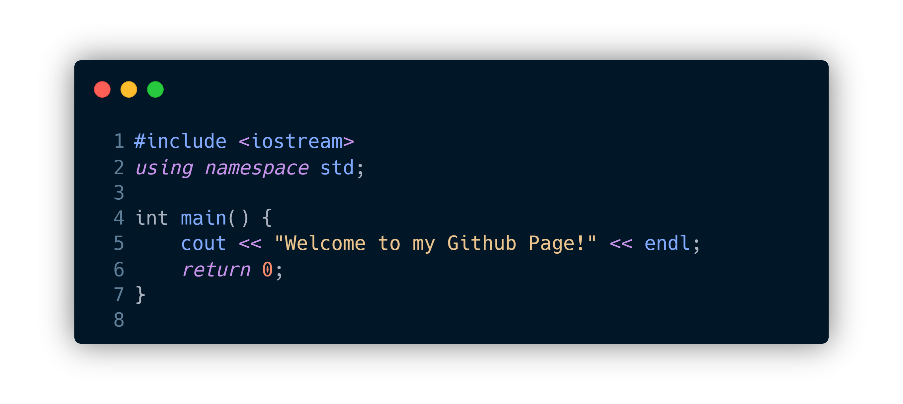

<!-- ## Hi.
I'm fine. Thank you, and you? -->

<h1 align="center">Hi there, I'm franky</h1>
<h3 align="center">Software Engineer | AI Agent Developer</h3>

  
  

 

<!-- 
<h3 align="center">Best repositories</h3>

 -->

---

- 🔭 I’m currently working as an AI Security Engineer in Singapore.

- 🌱 I’m currently focusing on LLM Security and Agents Development matters.

- 💬 I completed Master of Science in Artificial Intelligence (MSAI) at Nanyang Technological University.

- 📫 How to reach me: **frankyoung@outlook.sg**

- 😄 Pronouns: He/him

---

<h3 align="center">Languages and Tools</h3>

&nbsp;&nbsp;&nbsp;&nbsp;&nbsp;&nbsp;&nbsp;&nbsp;&nbsp;&nbsp;&nbsp;&nbsp;&nbsp;&nbsp;&nbsp;&nbsp;&nbsp;&nbsp;&nbsp;&nbsp;&nbsp;&nbsp;&nbsp;&nbsp;&nbsp;&nbsp;&nbsp;&nbsp;&nbsp;&nbsp;&nbsp;&nbsp;&nbsp;&nbsp;&nbsp;&nbsp;

