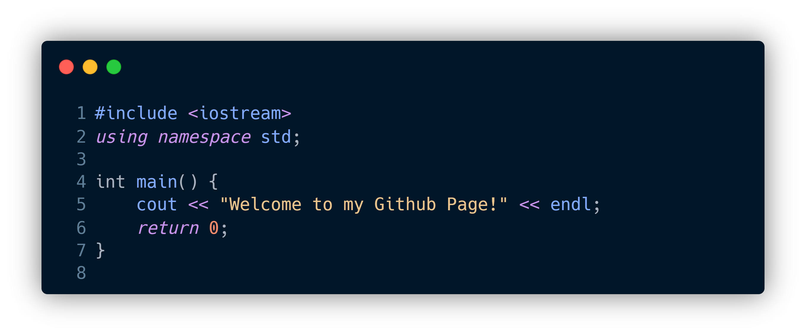

<!-- ## Hi.
I'm fine. Thank you, and you? -->

<h1 align="center">Hi there, I'm franky</h1>
<h3 align="center">An aspiring Full-stack Software Developer & Agent Developer</h3>

  
  

 

<!--  -->
<!--  -->
<!-- 

 -->
<!--  -->
<!--    -->

  

<!-- 
<h3 align="center">Best repositories</h3>

 -->

---

- 🔭 I’m currently working as an AI Security Engineer in Singapore.
- 🌱 I’m currently focusing on LLM Security and Agents Development matters.
<!-- - 👯 I’m looking to collaborate on ...
- 🤔 I’m looking for help with ...-->
- 💬 I completed Master of Science in Artificial Intelligence (MSAI) at Nanyang Technological University.

- 📫 How to reach me: **frankyoung@outlook.sg**

- 😄 Pronouns: He/him

---

  <h2>🐍 My Contributions 🐍</h2>
   
  
  
     

---

<h3 align="center">Languages and Tools</h3>

